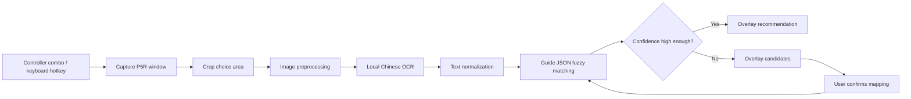

# P5R Assistant Design

Date: 2026-06-14

## Goal

Build a Windows desktop assistant for the Chinese version of Persona 5 Royal. During confidant dialogue choices, the user presses a controller hotkey and the assistant automatically captures the game window, recognizes visible Chinese options, matches them against a local guide database, and shows the highest-affection choice in a small overlay.

The first version prioritizes low game impact, local processing, and reliable recommendations over full automation.

## Scope

In scope for version 1:

- Initialize a local guide database from the existing `htmls` guide pages.
- Run as a Windows tray application.
- Listen for a class-Xbox controller combo, default `LB + RB + Y`.
- Provide a keyboard fallback hotkey, default `Ctrl + Alt + P`.
- Automatically capture the P5R window after hotkey activation.
- Crop the likely dialogue choice region.
- Run local Chinese OCR.
- Normalize OCR and guide text.
- Match visible option groups against guide entries with fuzzy matching.
- Show the recommended option, affection value, source, and confidence in an always-on-top overlay.
- Show candidates instead of making a hard recommendation when confidence is low.
- Save user-confirmed text mappings in a separate alias file.

Out of scope for version 1:

- Continuous real-time screen monitoring.
- Automatic in-game selection or controller input injection.
- Default cloud vision recognition.
- Full player state tracking for current date, rank, weather, or persona inventory.
- Multi-game support.
- Cloud sync or shared guide updates.

## User Flow

Normal flow:

1. User reaches a dialogue choice in P5R.
2. User presses `LB + RB + Y`.
3. App captures the P5R window automatically.
4. App crops and preprocesses the choice area.
5. Local OCR extracts visible options.
6. Matcher finds the closest guide option group.
7. Overlay displays the best choice.
8. Overlay auto-hides after a short timeout.

The hotkey represents a complete recognition request, not a screenshot request. No screenshot confirmation is shown during normal use.

Low-confidence flow:

1. OCR or matching confidence is below the configured threshold.
2. Overlay shows likely candidate guide events.
3. User can choose a candidate with controller controls.
4. Confirmed mapping is written to `data/aliases.json`.

Calibration flow:

1. User opens settings and chooses recognition calibration.
2. App captures the current P5R window.
3. User drags the choice-text region if automatic cropping is wrong.
4. User runs a test OCR.
5. App saves the crop region to `data/settings.json`.

## Architecture



Core modules:

- `Guide Importer`: parses local HTML guide pages and generates structured JSON.
- `Hotkey Listener`: listens to controller combo and keyboard fallback.
- `Capture Engine`: finds and screenshots the P5R window.
- `OCR Engine`: preprocesses cropped images and runs local OCR.
- `Matcher`: normalizes text, applies aliases, and fuzzy-matches option groups.
- `Overlay UI`: displays recommendations and candidate choices.
- `Correction Store`: persists user-confirmed text mappings.

## Data Files

Runtime data lives under `data/`:

```text
data/
  guide.json
  aliases.json
  settings.json
```

`guide.json` is generated from local HTML and should not be manually edited. `aliases.json` stores user confirmations and should survive guide regeneration. `settings.json` stores hotkeys, OCR engine choice, crop region, thresholds, and overlay preferences.

Suggested `guide.json` shape:

```json
{
  "version": 1,
  "generated_at": "2026-06-14T00:00:00+08:00",
  "source_dir": "D:\\P5R Assistant\\htmls",
  "confidants": [
    {
      "id": "ann",
      "name": "高卷杏",
      "events": [
        {
          "id": "ann_rank_2",
          "type": "rank_up",
          "rank_from": 1,
          "rank_to": 2,
          "questions": [
            {
              "id": "ann_rank_2_q1",
              "choices": [
                {
                  "id": "ann_rank_2_q1_c1",
                  "index": 1,
                  "text": "什么意思？",
                  "normalized": "什么意思",
                  "points": 0
                }
              ]
            }
          ]
        }
      ]
    }
  ]
}
```

Suggested alias entry:

```json
{
  "ocr_text": "随他们怎么说吧",
  "canonical_text": "随便他们怎么说吧",
  "choice_id": "ann_rank_2_q1_c2",
  "created_at": "2026-06-14T00:00:00+08:00"
}
```

## HTML Guide Import

The local `htmls` directory is treated as raw source material. Runtime matching should not query HTML directly.

Importer behavior:

- Read each confidant HTML page.
- Locate sections such as `COOP对话攻略`, `提升事件`, `景点事件`, and related tables.
- Extract confidant name, event type, rank, question order, choices, points, and conditions where available.
- Preserve original display text.
- Store normalized text alongside original text.
- Report unparsed or ambiguous tables in an import report.

The importer should be rerunnable. Regenerating `guide.json` must not overwrite `aliases.json`.

## OCR Strategy

Version 1 uses local OCR by default. Cloud vision can be added later as an explicit fallback, but should not be part of the default path.

Recommended engines:

- Primary: RapidOCR for lighter deployment and good Windows usability.
- Alternative: PaddleOCR if Chinese accuracy is insufficient.
- Avoid relying on Tesseract unless testing proves it handles the game UI acceptably.

OCR pipeline:

1. Capture P5R window.
2. Crop likely choice area.
3. Enlarge crop by 2x or 3x.
4. Convert to grayscale.
5. Increase contrast.
6. Apply thresholding when useful.
7. Run OCR.
8. Group recognized text lines into option candidates.

The app should keep OCR behind an interface so engines can be swapped without changing capture or matching code.

## Matching Strategy

Exact text equality is not required.

Matching stages:

1. Normalize OCR and guide text.
2. Apply known aliases.
3. Compare the whole visible option group against each guide question.
4. Score candidate guide questions using option count, order, text similarity, alias hits, OCR confidence, and optional context.
5. Select the best guide question if score passes threshold.
6. Recommend the choice or choices with the highest `points`.

Text normalization includes:

- Remove whitespace and line breaks.
- Normalize full-width and half-width forms.
- Normalize punctuation such as question marks, exclamation marks, ellipses, and quotes.
- Optionally convert traditional and simplified Chinese.
- Remove OCR noise that is known to occur frequently.

Confidence policy:

- `>= 0.85`: show direct recommendation.
- `0.65` to `< 0.85`: show likely recommendation with uncertainty and allow candidate expansion.
- `< 0.65`: do not make a hard recommendation; show candidates for confirmation.

## Interface

The app has two surfaces: a tray app and a game overlay.

Tray menu:

- Enable or pause assistant.
- Test screenshot recognition.
- Open settings.
- Reimport guide HTML.
- View recent recognitions.
- Exit.

Overlay behavior:

- Always on top.
- Small and nonblocking.
- Default position: top-right or top-left.
- Auto-hides after 3 to 5 seconds.
- Shows only key information during confident matches.

Confident overlay content:

```text
P5R Assistant

推荐：第 2 项
随便他们怎么说吧

好感：+3
高卷杏 / Rank 2 / 置信度 92%
```

Low-confidence overlay content:

```text
匹配不确定

A. 高卷杏 Rank 2
推荐：第 2 项 / +3 / 68%

B. 高卷杏 景点事件
推荐：第 1 项 / +3 / 61%
```

Controller interactions while overlay is visible:

- `B`: close overlay.
- D-pad up/down: switch candidate.
- `A`: confirm candidate and save alias mapping.

Settings tabs:

- Hotkeys: controller combo, keyboard fallback, hotkey test state.
- Recognition: OCR engine, screenshot target, crop calibration, confidence threshold.
- Guide: imported confidant count, event count, option count, reimport button, import errors.
- Display: overlay position, timeout, font size, source/confidence visibility.

The visual style should be utility-first: dark translucent background, white text, yellow highlight for the recommendation, and no elaborate Persona-style imitation.

## Technical Choice

Version 1 should use Python.

Recommended packages:

- UI and tray: `PySide6`
- Screenshot: `mss`, with `dxcam` as a future optimization
- Window lookup: `pywin32`
- OCR: `rapidocr` first, `paddleocr` as alternative
- Image preprocessing: `opencv-python`
- HTML parsing: `beautifulsoup4` and `lxml`
- Fuzzy matching: `rapidfuzz`
- Controller input: `inputs` or `pygame`, verified against the user's class-Xbox controller
- Keyboard fallback: `keyboard` or Windows global hotkey registration

Python is preferred for version 1 because OCR, image processing, guide parsing, and fuzzy matching are the core risks. A native .NET or Tauri shell can be reconsidered after the recognition pipeline is proven.

Suggested project structure:

```text
p5r_assistant/
  app.py
  ui/
    tray.py
    overlay.py
    settings_window.py
  input/
    gamepad.py
    keyboard_hotkey.py
  capture/
    window_finder.py
    screenshot.py
    crop.py
  ocr/
    engine.py
    rapidocr_engine.py
    preprocess.py
  guide/
    importer.py
    schema.py
    repository.py
  match/
    normalize.py
    matcher.py
    aliases.py
  config/
    settings.py
```

## Error Handling

The app should surface clear failures:

- Game window not found: ask user to confirm the game is running or select target mode.
- Screenshot failed: suggest windowed or borderless mode.
- No option text detected: suggest retry or calibration.
- OCR confidence low: suggest retry or crop adjustment.
- No guide match: show candidates or manual search.
- Match confidence low: show candidate events instead of a hard recommendation.

Debug mode may save recent crops, OCR output, and match score details under `logs/`. Full screenshots should not be saved by default.

## Performance Expectations

Idle performance should be near zero CPU usage because the app does not continuously inspect the game window.

Expected hotkey-triggered latency:

- Screenshot: tens of milliseconds.
- Crop and preprocessing: tens of milliseconds.
- OCR: hundreds of milliseconds to about 1 second depending on engine and hardware.
- Matching: milliseconds.

Target: show overlay within 0.5 to 2 seconds after hotkey press.

## Test Plan

Importer tests:

- Parse a representative saved HTML page.
- Verify confidant, event, question, choices, and points are extracted.
- Verify ambiguous or unsupported tables are reported instead of silently ignored.

Normalization tests:

- Verify punctuation, whitespace, full-width/half-width, and ellipsis variants normalize consistently.
- Verify likely OCR noise does not break matching.

Matcher tests:

- Exact option group match.
- Slightly different game text vs guide text.
- OCR typo cases.
- Multiple candidate events with low confidence.
- Alias match improves score.

Capture and OCR tests:

- Use fixture screenshots under `tests/fixtures/screenshots/`.
- Verify crop region produces expected visible text.
- Verify OCR output is grouped into 2 or 3 choices.

UI tests:

- Overlay displays confident recommendation.
- Overlay displays low-confidence candidates.
- Overlay hides on timeout and close command.

Manual acceptance tests:

- App starts and appears in system tray.
- Class-Xbox controller combo triggers recognition.
- Keyboard fallback triggers recognition.
- `htmls` can be imported into `data/guide.json`.
- Sample screenshot produces a recommendation.
- Low-confidence confirmation writes `data/aliases.json`.
- Idle CPU usage remains negligible.

## Open Risks

- HTML table layouts may vary by confidant page and require parser exceptions.
- OCR accuracy on P5R's stylized Chinese text must be validated with real screenshots.
- Controller libraries differ in XInput behavior; the selected package must be tested with the user's class-Xbox controller.
- Automatic crop defaults may vary by resolution, aspect ratio, and display scaling.
- Some guide entries may lack complete point data or have text that differs significantly from the game.

## Approval

This design is ready to become an implementation plan after user review.
